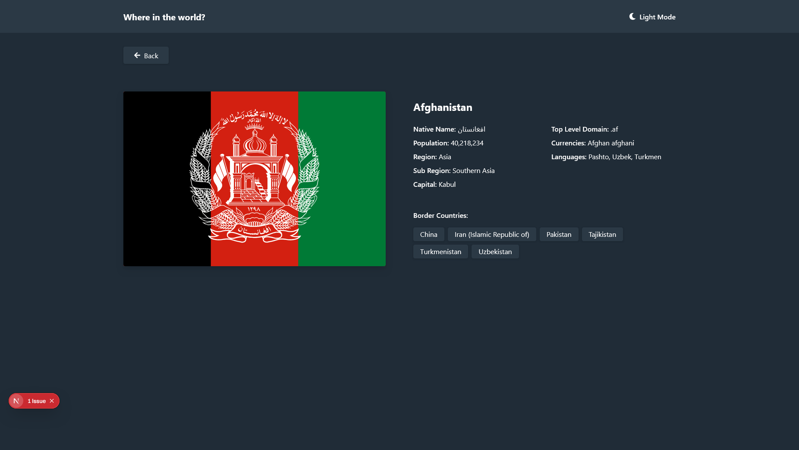
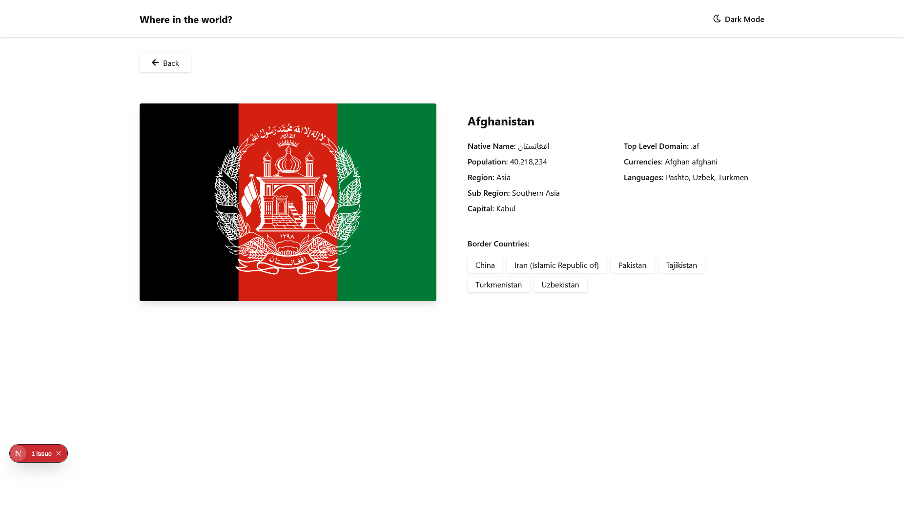

# Frontend Mentor - REST Countries API with color theme switcher solution

This is a solution to the [REST Countries API with color theme switcher challenge on Frontend Mentor](https://www.frontendmentor.io/challenges/rest-countries-api-with-color-theme-switcher-5cacc469fec04111f7b848ca).

## Table of contents

- [Overview](#overview)
  - [The challenge](#the-challenge)
  - [Screenshots](#screenshots)
  - [Links](#links)
- [My process](#my-process)
  - [Built with](#built-with)
  - [What I learned](#what-i-learned)
  - [Continued development](#continued-development)
- [Author](#author)

## Overview

### The challenge

Users should be able to:

- See all countries from the API on the homepage
- Search for a country using an `input` field
- Filter countries by region
- Click on a country to see more detailed information on a separate page
- Click through to the border countries on the detail page
- Toggle the color scheme between light and dark mode

### Screenshots

| Light Mode | Dark Mode |
|------------|-----------|
|  
|  |

| 

### Links

- Solution URL: [Frontend Mentor Solution](https://www.frontendmentor.io/solutions/rest-countries-api-with-nextjs-and-tailwind-css-2lX9YQZR6b)
- Live Site URL: [Live Demo](https://rest-countries-api-with-color-theme-pi.vercel.app/)

## My process

### Built with

- [Next.js](https://nextjs.org/) - React framework
- [Tailwind CSS](https://tailwindcss.com/) - For styles
- [React Icons](https://react-icons.github.io/react-icons/) - For icons
- Mobile-first workflow
- Semantic HTML5 markup
- Flexbox and CSS Grid
- TypeScript for type safety

### What I learned

Through this project, I gained valuable experience with:

- Implementing a theme switcher using React context
- Fetching and displaying data from a REST API
- Creating responsive layouts with Tailwind CSS
- Building dynamic routes in Next.js
- Handling state management for search and filter functionality
- TypeScript integration for better code reliability

Some code highlights:

```tsx
// Theme context implementation
export const ThemeContext = createContext<ThemeContextType>({
  mode: 'light',
  modes: {
    light: {
      bgColor: 'bg-white',
      textColor: 'text-gray-800',
      bgElements: 'bg-gray-100',
    },
    dark: {
      bgColor: 'bg-gray-900',
      textColor: 'text-white',
      bgElements: 'bg-gray-700',
    }
  },
  setTheme: () => {}
});
```
```
// Dynamic country detail page
const CountryPage = () => {
  const params = useParams();
  const countryParams = Array.isArray(params?.data) ? params.data : [];
  const countryName = countryParams[0];
  const countryNumericCode = countryParams[1];
  
  // ...data fetching and rendering logic
}
```

Continued development
Areas I'd like to focus on in future projects:

Implementing more advanced search functionality

Adding animations and transitions

Improving loading states with skeletons

Adding tests for better code reliability

Exploring more complex state management solutions

### Useful resources

- [Example resource 1](https://www.example.com) - This helped me for XYZ reason. I really liked this pattern and will use it going forward.
- [Example resource 2](https://www.example.com) - This is an amazing article which helped me finally understand XYZ. I'd recommend it to anyone still learning this concept.

**Note: Delete this note and replace the list above with resources that helped you during the challenge. These could come in handy for anyone viewing your solution or for yourself when you look back on this project in the future.**

## Author

- Website - [Joel Olajire](https://startbootstrap-personal.vercel.app/)
- Frontend Mentor - [@JuzzJoel](https://www.frontendmentor.io/profile/JuzzJoel)
- Twitter - [@JOOlajire](https://x.com/@JOOlajire)

**Note: Delete this note and add/remove/edit lines above based on what links you'd like to share.**

## Acknowledgments

This is where you can give a hat tip to anyone who helped you out on this project. Perhaps you worked in a team or got some inspiration from someone else's solution. This is the perfect place to give them some credit.

**Note: Delete this note and edit this section's content as necessary. If you completed this challenge by yourself, feel free to delete this section entirely.**
